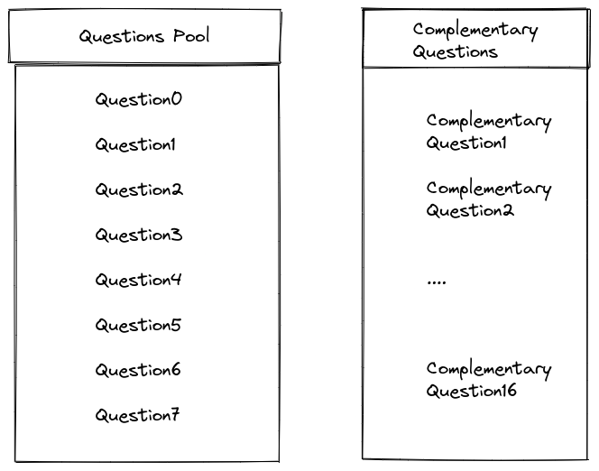
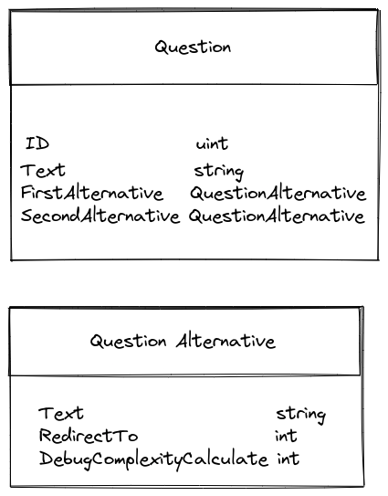
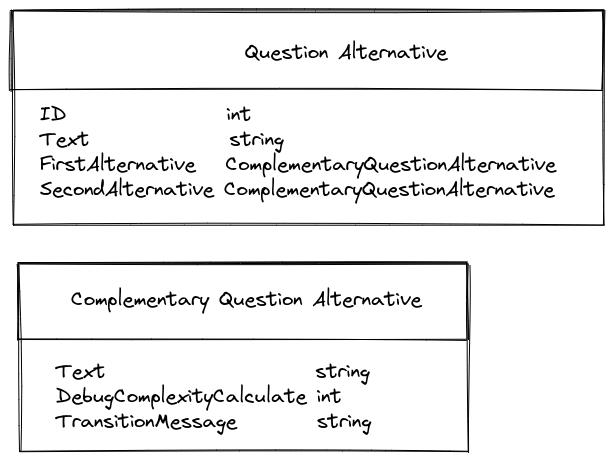
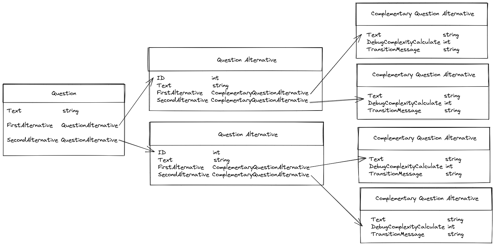

# text-game

Write a program for Text Game, where you will ask a question with 2 choices. The user's choice will lead to a new question with another 2 choices and so on. 
Ask user to enter the total number of questions to reach a destination should be configurable between 15 to 30. The solution should force the user to exhaust all 15 no matter what to arrive at the destination. user should not be able to answer in such a way that I get to the final result in 10 times

- Upload the code in git and share the git link.
- Use your creativity for questions and choices.
- Make sure the code is efficient 
- write unit tests

For example.

Q: Walking on the road you reach a fork, do you take left or right?
A: right
Q: You reached a lake, will you swim or go around it?
A: I will swim

The End! You are in Florida. Alligator caught you :)

## Setup

`make setup`

## Start Game

`make start-game`

## Build

`make build`

## Build and Run

`make build-and-run`

## Run tests

`make tests`

# Structure

## Shared Data

 
 

## Question Domain

 
 

## Complementary Question Domain

 
 
## Flow

